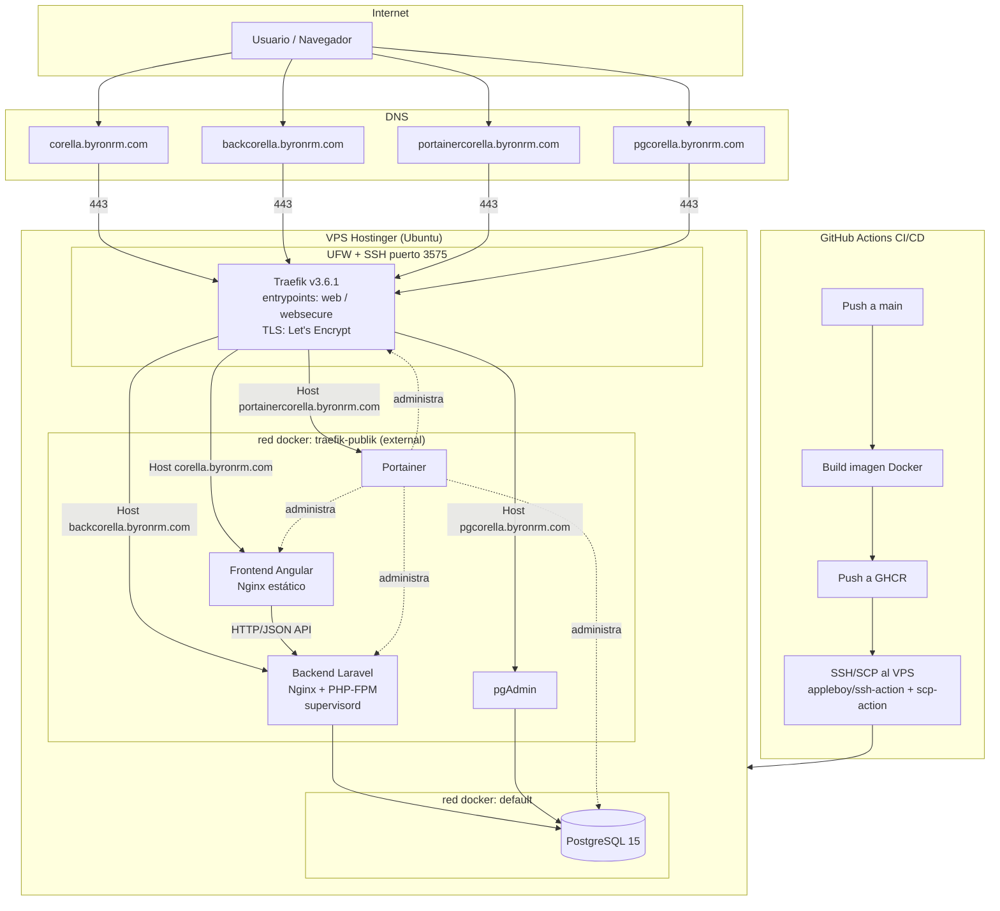

# Corella DevOps — Documentación de Despliegue

Sistema web compuesto por un **backend Laravel 12** y un **frontend Angular 19**, totalmente containerizados con Docker y desplegados en un VPS mediante un pipeline de **CI/CD con GitHub Actions**, usando **GHCR** como registro de imágenes, **Traefik v3** como reverse proxy/enrutador con TLS automático, y **Portainer** como panel de administración de contenedores.

## Repositorios

| Componente | Repositorio |
|---|---|
| Frontend (Angular 19) | https://github.com/yaviracjorge/frontDevops |
| Backend (Laravel 12) | https://github.com/yaviracjorge/backDevops |

## Servicios publicados

| Servicio | Subdominio | Descripción |
|---|---|---|
| Frontend | `corella.byronrm.com` | Aplicación Angular (SPA) |
| Backend | `backcorella.byronrm.com` | API Laravel |
| Portainer | `portainercorella.byronrm.com` | Administración gráfica de Docker |
| pgAdmin | `pgcorella.byronrm.com` | Administración gráfica de PostgreSQL |

Todos los subdominios resuelven mediante registros DNS tipo `A` hacia la IP pública del VPS, y Traefik enruta cada petición según el header `Host` a su contenedor correspondiente.

---

## . Arquitectura general



> Ver también el archivo `architecture-diagram.svg` adjunto para una versión estática del diagrama.

### Flujo de una petición

1. El usuario resuelve un subdominio (ej. `corella.byronrm.com`) vía DNS hacia la IP del VPS.
2. La petición llega al VPS por el puerto 443 (HTTPS), donde **Traefik** es el único servicio expuesto públicamente.
3. Traefik identifica el contenedor destino según las **labels** definidas en el `docker-compose`/`stack.yml` de cada servicio (regla `Host(...)`) y aplica el certificado TLS correspondiente (Let's Encrypt, resolver `letsencrypt`).
4. Traefik reenvía el tráfico al contenedor correcto dentro de la red Docker compartida `traefik-publik`.
5. El **Frontend** (Angular) consume la **API del Backend** (Laravel) vía peticiones HTTP/JSON hacia `backcorella.byronrm.com`.
6. El **Backend** se conecta a **PostgreSQL** usando el nombre del servicio (`db`) como host, resuelto por el DNS interno de Docker — no por IP fija.
7. **pgAdmin** y **Portainer** se publican cada uno en su propio subdominio para administración visual, ambos protegidos por sus propias credenciales.

---

## . Componentes y tecnologías

| Componente | Tecnología | Notas |
|---|---|---|
| Reverse proxy | Traefik v3.6.1 | Descubrimiento automático vía Docker labels, TLS automático con Let's Encrypt |
| Panel de administración | Portainer | Publicado vía subdominio propio |
| Frontend | Angular 19 + Nginx | Build multi-stage (Node para compilar, Nginx para servir estáticos) |
| Backend | Laravel 12 + PHP 8.2-FPM + Nginx | Un solo contenedor, Nginx y PHP-FPM administrados por **supervisord** |
| Base de datos | PostgreSQL 15 (alpine) | Persistencia en volumen Docker `postgres_data` |
| Administrador de BD | pgAdmin 4 | Publicado vía subdominio propio |
| Registro de imágenes | GitHub Container Registry (GHCR) | `ghcr.io/yaviracjorge/backend-devops` y `ghcr.io/yaviracjorge/angularapp` |
| CI/CD | GitHub Actions | Build → push a GHCR → despliegue por SSH/SCP al VPS |

---

## . Redes Docker

Se usan dos redes por stack:

- **`traefik-publik`** (externa, compartida entre Traefik, frontend, backend, Portainer y pgAdmin): permite que Traefik descubra y enrute hacia estos contenedores por nombre, ya que **Traefik y el servicio deben compartir la misma red** para que el proxy pueda alcanzar el contenedor destino.
- **`default`** (interna, por stack): usada para la comunicación privada entre el backend y la base de datos, y entre pgAdmin y la base de datos, sin exponerlas a la red pública.

La red `traefik-publik` se crea una sola vez de forma manual en el VPS (`docker network create traefik-publik`) y se declara como `external: true` en cada `docker-compose`/`stack.yml`, para que Traefik (que vive en su propio stack) y los stacks de aplicación puedan compartirla.

---

## . Variables de entorno

Las credenciales **nunca se versionan en el repositorio**; viven únicamente en un archivo `.env` en el VPS, cargado por cada stack vía `env_file`.

**Backend (`backDevops/.env` en el VPS):**

```env
DB_CONNECTION=pgsql
DB_HOST=db
DB_PORT=5432
DB_DATABASE=devops
DB_USERNAME=postgres
DB_PASSWORD=********
APP_KEY=base64:********
APP_URL=https://backcorella.byronrm.com
CORS_ALLOWED_ORIGINS=https://corella.byronrm.com
```

**Stack de base de datos (`backDevops/stack.yml`):**

```env
DB_PASSWORD=********
PGADMIN_PASSWORD=********
```

> `DB_HOST=db` funciona porque `db` es el nombre del servicio Postgres dentro de la misma red Docker — no se usa una IP fija.

---

## . Despliegue paso a paso

### .1. Preparación del VPS

1. Servidor: VPS Hostinger (Ubuntu), acceso `root`.
2. Hardening de SSH: puerto movido de 22 a **3575** mediante un *override* del socket de systemd (`systemctl edit ssh.socket` / `ssh.service`).
3. Firewall **UFW** habilitado, permitiendo solo:
   - `3575/tcp` (SSH)
   - `80/tcp` y `443/tcp` (HTTP/HTTPS)
4. Instalación de Docker Engine + Docker Compose plugin.
5. Creación de la red compartida:
   ```bash
   docker network create traefik-publik
   ```

### .2. Despliegue de Traefik + Portainer

Stack base (independiente de las apps), con Traefik escuchando en los entrypoints `web` (80, redirige a HTTPS) y `websecure` (443, TLS vía Let's Encrypt), y Portainer publicado con sus propias labels apuntando a `portainercorella.byronrm.com`.

### 5.3. Despliegue del Backend (Laravel)

- `Dockerfile` (multi-stage no; single-stage con base `php:8.2-fpm-alpine`):
  - Instala extensiones PHP necesarias (`pdo_pgsql`, `mbstring`, `zip`, `bcmath`, etc.).
  - Instala dependencias con Composer (`--no-dev`).
  - Copia configuración de `docker/nginx.conf` y `docker/supervisord.conf`.
  - `supervisord` administra **Nginx** y **PHP-FPM** como dos procesos dentro de un mismo contenedor.
- `stack.yml` levanta `db` (Postgres), `pgadmin` y `backend`, todos con labels de Traefik para sus respectivos subdominios.
- El backend depende de que la base de datos esté saludable (`condition: service_healthy`) antes de arrancar.

### .4. Despliegue del Frontend (Angular)

- `Dockerfile` multi-stage:
  - **Stage 1**: imagen Node, `npm install` + `ng build` (producción).
  - **Stage 2**: imagen Nginx, copia solo los archivos estáticos compilados (`dist/`) y la configuración `nginx.conf`.
- `docker-compose.yml` publica el contenedor en la red `traefik-publik` con labels de Traefik apuntando a `corella.byronrm.com`.

### .5. CI/CD (GitHub Actions)

Flujo (por repositorio, en `.github/workflows/`):

1. **Checkout** del código (`actions/checkout`).
2. **Build** de la imagen Docker.
3. **Login y push** a GHCR (`docker/login-action`, `docker/build-push-action`).
4. **Copia de archivos de configuración** al VPS con `appleboy/scp-action` (ej. `stack.yml`/`docker-compose.yml`).
5. **Conexión SSH y despliegue** con `appleboy/ssh-action`: `docker pull` de la nueva imagen + `docker compose up -d` (o `docker stack deploy`) para recrear el contenedor con la imagen actualizada.

Secrets usados en GitHub Actions: credenciales de GHCR, host/usuario/puerto/clave o contraseña SSH del VPS.

---

## . Troubleshooting (incidentes reales resueltos)

| Problema | Causa | Solución |
|---|---|---|
| Traefik no descubría los contenedores | Incompatibilidad de versión Traefik ↔ API de Docker | Actualización a Traefik **v3.6.1** |
| Workflow fallaba en el paso de despliegue | Nombre de secret de GitHub Actions no coincidía con el usado en el YAML | Renombrado y sincronizado con el workflow |
| Backend/frontend no se conectaban vía Traefik | Nombre de red Docker distinto entre el stack de Traefik y el stack de la app | Unificación bajo la red externa **`traefik-publik`** |
| Job de Actions fallaba al no encontrar archivos | Faltaba el paso `actions/checkout` | Se agregó el step de checkout al inicio del job |
| (Proyecto previo, Docker Swarm) Traefik no enrutaba en modo Swarm | Redes *overlay* de Swarm no son compatibles con una instancia standalone de Traefik | Se documentó como limitación arquitectónica para ese caso |

---
